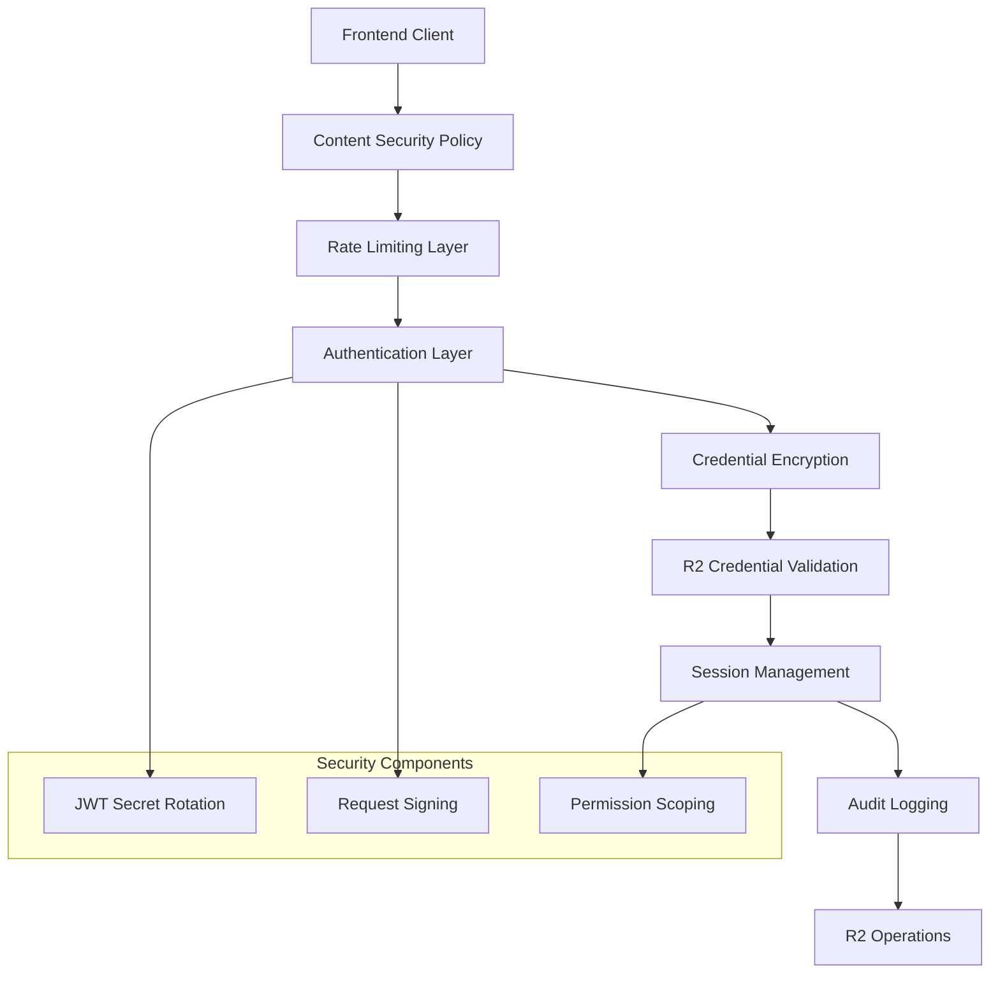
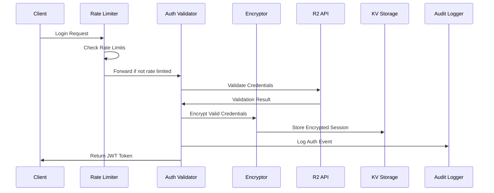

# Design Document

## Overview

This design implements a comprehensive security enhancement for the R2 File Explorer, addressing critical vulnerabilities in credential management, authentication, and session security. The solution prioritizes high-impact security improvements while maintaining system performance and user experience. The design follows defense-in-depth principles with multiple layers of security controls.

## Architecture

### Security Layer Architecture



### Data Flow Security



## Components and Interfaces

### 1. Credential Encryption Service

**Purpose**: Encrypt/decrypt R2 credentials before storage in KV

**Interface**:
```typescript
interface CredentialEncryption {
  encrypt(credentials: AuthCredentials, sessionId: string): Promise<EncryptedCredentials>
  decrypt(encryptedData: EncryptedCredentials, sessionId: string): Promise<AuthCredentials>
  rotateEncryptionKey(): Promise<void>
}

interface EncryptedCredentials {
  encryptedData: string
  iv: string
  authTag: string
  keyVersion: number
}
```

**Implementation Details**:
- Uses Web Crypto API (SubtleCrypto) for AES-256-GCM encryption in Cloudflare Workers
- Master key stored as Cloudflare Worker secret (CREDENTIAL_ENCRYPTION_KEY)
- Derives session-specific keys using PBKDF2 with 100,000 iterations
- Key derivation: `PBKDF2(masterKey + sessionId + salt, iterations=100000, keyLength=32)`
- Generates cryptographically secure random IVs using `crypto.getRandomValues()`
- Implements key versioning for seamless master key rotation
- Uses constant-time comparison for authentication tag validation
- Fallback to Node.js crypto module for development/testing environments

### 2. R2 Credential Validator

**Purpose**: Validate credentials against actual R2 API before accepting them

**Interface**:
```typescript
interface CredentialValidator {
  validateCredentials(credentials: AuthCredentials): Promise<ValidationResult>
  testBucketAccess(credentials: AuthCredentials): Promise<PermissionScope>
}

interface ValidationResult {
  isValid: boolean
  permissions: PermissionScope
  error?: string
}

interface PermissionScope {
  canRead: boolean
  canWrite: boolean
  canDelete: boolean
  bucketAccess: string[]
}
```

**Implementation Details**:
- Tests credentials with minimal R2 operations (list bucket)
- Determines actual permissions through API testing
- Implements timeout and retry logic for API calls
- Caches validation results for short periods to reduce API calls

### 3. Rate Limiting Service

**Purpose**: Prevent brute force attacks on authentication endpoints

**Interface**:
```typescript
interface RateLimiter {
  checkLoginAttempt(ipAddress: string): Promise<RateLimitResult>
  recordFailedAttempt(ipAddress: string): Promise<void>
  recordSuccessfulAttempt(ipAddress: string): Promise<void>
  resetLimits(ipAddress: string): Promise<void>
}

interface RateLimitResult {
  allowed: boolean
  remainingAttempts: number
  resetTime: Date
}
```

**Implementation Details**:
- Uses sliding window algorithm with KV storage
- Configurable limits per IP address
- Exponential backoff for repeated violations
- Allow list support for trusted IPs

### 4. JWT Secret Management

**Purpose**: Support multiple JWT secrets for rotation without downtime

**Interface**:
```typescript
interface JWTSecretManager {
  getCurrentSigningSecret(): Promise<string>
  getValidationSecrets(): Promise<string[]>
  rotateSecret(newSecret: string): Promise<void>
  validateToken(token: string): Promise<JWTValidationResult>
}

interface JWTValidationResult {
  valid: boolean
  payload?: JWTPayload
  secretVersion?: number
}
```

**Implementation Details**:
- Maintains multiple active secrets in KV
- Uses newest secret for signing, all active secrets for validation
- Implements gradual secret retirement
- Supports emergency secret revocation

### 5. Enhanced Session Manager

**Purpose**: Implement absolute and sliding session timeouts

**Interface**:
```typescript
interface EnhancedSessionManager {
  createSession(credentials: AuthCredentials, ipAddress: string): Promise<SessionResult>
  validateSession(token: string): Promise<SessionData | null>
  refreshSession(token: string): Promise<SessionResult | null>
  revokeSession(token: string): Promise<boolean>
  cleanupExpiredSessions(): Promise<number>
}

interface SessionResult {
  token: string
  expiresAt: number
  absoluteExpiresAt: number
}
```

**Implementation Details**:
- Tracks both sliding and absolute expiration times
- Implements session cleanup background process
- Stores minimal session data with encrypted credentials
- Supports session invalidation across all instances

### 6. Audit Logging Service

**Purpose**: Comprehensive security event logging

**Interface**:
```typescript
interface AuditLogger {
  logAuthEvent(event: AuthEvent): Promise<void>
  logSecurityEvent(event: SecurityEvent): Promise<void>
  logRateLimitEvent(event: RateLimitEvent): Promise<void>
  queryAuditLogs(filter: AuditFilter): Promise<AuditEvent[]>
}

interface AuthEvent {
  timestamp: Date
  eventType: 'login' | 'logout' | 'token_refresh' | 'validation_failure'
  ipAddress: string
  userAgent?: string
  success: boolean
  errorCode?: string
  bucketName?: string
}
```

**Implementation Details**:
- Uses Cloudflare Analytics Engine for log storage
- Implements structured logging with searchable fields
- Supports log retention policies
- Provides security dashboard integration

## Data Models

### Enhanced Session Data Structure

```typescript
interface EnhancedSessionData {
  userId: string
  encryptedCredentials: EncryptedCredentials
  permissions: PermissionScope
  createdAt: number
  lastAccessedAt: number
  expiresAt: number
  absoluteExpiresAt: number
  ipAddress: string
  userAgent?: string
}
```

### Master Key Management Strategy

**Cloudflare Worker Secrets**:
- Primary master key stored as `CREDENTIAL_ENCRYPTION_KEY` worker secret
- Backup key stored as `CREDENTIAL_ENCRYPTION_KEY_BACKUP` for rotation
- Keys generated using cryptographically secure random number generator
- Minimum 256-bit (32-byte) key length requirement
- Keys rotated every 90 days through automated process

**Key Rotation Process**:
1. Generate new master key using `crypto.getRandomValues()`
2. Store as backup secret while maintaining current key
3. Update key version in KV storage
4. Gradually re-encrypt existing sessions with new key
5. Retire old key after all sessions migrated (max 24 hours)

**Security Controls**:
- Keys never logged or exposed in application code
- Access restricted to production deployment pipeline
- Key rotation events logged to audit system
- Emergency key revocation capability through Wrangler CLI

### Rate Limit Storage

```typescript
interface RateLimitData {
  ipAddress: string
  attempts: number
  firstAttempt: number
  lastAttempt: number
  blockedUntil?: number
}
```

### JWT Secret Storage

```typescript
interface JWTSecretData {
  version: number
  secret: string
  createdAt: number
  status: 'active' | 'deprecated' | 'revoked'
  expiresAt?: number
}
```

## Error Handling

### Security Error Categories

1. **Authentication Errors**
   - Invalid credentials
   - Rate limit exceeded
   - Token validation failures
   - Session timeouts

2. **Encryption Errors**
   - Key derivation failures
   - Encryption/decryption errors
   - Key rotation issues

3. **Validation Errors**
   - R2 API connectivity issues
   - Permission validation failures
   - Credential format errors

### Error Response Strategy

- Return generic error messages to prevent information leakage
- Log detailed error information for debugging
- Implement progressive delays for repeated failures
- Provide clear user guidance for recoverable errors

## Testing Strategy

### Security Testing Approach

1. **Unit Tests**
   - Encryption/decryption functionality
   - Rate limiting algorithms
   - JWT secret rotation
   - Session timeout logic

2. **Integration Tests**
   - End-to-end authentication flows
   - R2 credential validation
   - Cross-component security interactions
   - Error handling scenarios

3. **Security Tests**
   - Penetration testing for rate limiting
   - Encryption key security validation
   - Session hijacking prevention
   - XSS and CSRF protection

4. **Performance Tests**
   - Authentication latency under load
   - Encryption overhead measurement
   - Rate limiting performance impact
   - Session cleanup efficiency

### Test Data Security

- Use mock credentials for testing
- Implement test environment isolation
- Secure test data cleanup procedures
- Validate security controls in test environments

## Implementation Phases

### Phase 1: Critical Security (High Priority)
- Credential encryption in KV storage
- Actual R2 credential validation
- Basic rate limiting implementation

### Phase 2: Enhanced Security (Medium Priority)
- JWT secret rotation system
- Absolute session timeouts
- Permission scoping implementation

### Phase 3: Advanced Security (Lower Priority)
- Comprehensive audit logging
- Content Security Policy implementation
- Request signing for API security

## Performance Considerations

### Optimization Strategies

1. **Caching**
   - Cache credential validation results
   - Cache permission scopes
   - Cache rate limit data in memory

2. **Async Processing**
   - Background session cleanup
   - Asynchronous audit logging
   - Non-blocking encryption operations

3. **Resource Management**
   - Connection pooling for R2 API calls
   - Efficient KV storage patterns
   - Memory-efficient encryption

### Monitoring and Metrics

- Authentication success/failure rates
- Encryption operation latency
- Rate limiting effectiveness
- Session cleanup performance
- Security event frequencies