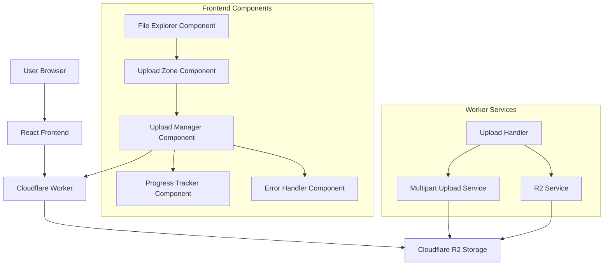

# Design Document

## Overview

The File Upload functionality for the R2 File Explorer will enable users to upload files to their Cloudflare R2 buckets through an intuitive web interface. The implementation will support both single and multiple file uploads, drag-and-drop functionality, progress tracking, and handling of large files through multipart uploads. The design will focus on providing a seamless user experience while ensuring reliability, performance, and proper error handling.

## Architecture

### High-Level Architecture



## Components and Interfaces

### Frontend Components

#### 1. UploadZone Component

The UploadZone component will provide a drag-and-drop interface for file uploads and will be integrated into the FileExplorer component.

```typescript
interface UploadZoneProps {
  currentPath: string;
  onUploadStart: (files: File[]) => void;
  onUploadComplete: () => void;
  disabled?: boolean;
}

const UploadZone: React.FC<UploadZoneProps> = ({ currentPath, onUploadStart, onUploadComplete, disabled }) => {
  // Implementation details
}
```

Key features:
- Drag-and-drop area with visual feedback
- File input for traditional file selection
- Upload button that triggers the hidden file input element's click event
- Validation of file types and sizes
- Integration with React Dropzone library
- Handling of folder uploads (where supported by browsers)

Implementation of file selection dialog:
```typescript
// Inside UploadZone component
const fileInputRef = useRef<HTMLInputElement>(null);

const handleUploadButtonClick = () => {
  // Trigger the hidden file input's click event
  if (fileInputRef.current) {
    fileInputRef.current.click();
  }
};

// In the render function
return (
  <div className="upload-zone">
    {/* Drag-and-drop area */}
    <div {...getRootProps({ className: 'dropzone' })}>
      <input {...getInputProps()} ref={fileInputRef} multiple />
      <p>Drag files here or click to select</p>
    </div>
    
    {/* Explicit upload button */}
    <button 
      className="upload-button"
      onClick={handleUploadButtonClick}
      disabled={disabled}
    >
      Upload Files
    </button>
  </div>
);
```

#### 2. UploadManager Component

The UploadManager component will handle the upload process, including tracking progress, managing the upload queue, and handling errors.

```typescript
interface UploadManagerProps {
  files: File[];
  currentPath: string;
  onComplete: () => void;
  onError: (error: Error) => void;
}

const UploadManager: React.FC<UploadManagerProps> = ({ files, currentPath, onComplete, onError }) => {
  // Implementation details
}
```

Key features:
- Upload queue management
- Progress tracking for individual files and overall progress
- Automatic handling of multipart uploads for large files
- Retry logic for failed uploads
- Cancellation support

#### 3. UploadProgressItem Component

The UploadProgressItem component will display the progress of a single file upload.

```typescript
interface UploadProgressItemProps {
  file: File;
  progress: number;
  status: 'pending' | 'uploading' | 'completed' | 'error' | 'canceled';
  error?: string;
  onCancel: () => void;
  onRetry: () => void;
}

const UploadProgressItem: React.FC<UploadProgressItemProps> = ({ file, progress, status, error, onCancel, onRetry }) => {
  // Implementation details
}
```

Key features:
- Visual progress indicator
- File metadata display (name, size, type)
- Cancel and retry buttons
- Status indication (pending, uploading, completed, error, canceled)
- Error message display

#### 4. UploadDialog Component

The UploadDialog component will provide a modal dialog for managing uploads.

```typescript
interface UploadDialogProps {
  isOpen: boolean;
  onClose: () => void;
  currentPath: string;
  onUploadComplete: () => void;
}

const UploadDialog: React.FC<UploadDialogProps> = ({ isOpen, onClose, currentPath, onUploadComplete }) => {
  // Implementation details
}
```

Key features:
- Modal dialog with file selection options
- Upload progress display for multiple files
- Summary of upload status
- Close button that confirms before closing if uploads are in progress

### Backend API Endpoints

#### 1. File Upload Endpoint

```
POST /api/files/upload
- Headers: Authorization: Bearer <token>
- Body: FormData with files and path
- Response: { success: true, uploaded: string[], errors: string[] }
```

This endpoint will handle single file uploads and small files. It will:
- Validate the request (authentication, file size, etc.)
- Extract files from the FormData
- Upload each file to R2 using the R2Service
- Return a list of successfully uploaded files and any errors

#### 2. Multipart Upload Endpoints

For large files (>100MB), we'll use multipart uploads with the following endpoints:

```
POST /api/files/multipart/create
- Headers: Authorization: Bearer <token>
- Body: { key: string, contentType?: string }
- Response: { success: true, uploadId: string, key: string }

POST /api/files/multipart/upload-part
- Headers: Authorization: Bearer <token>
- Query: key, uploadId, partNumber
- Body: Part data (binary)
- Response: { success: true, partNumber: number, etag: string }

POST /api/files/multipart/complete
- Headers: Authorization: Bearer <token>
- Body: { key: string, uploadId: string, parts: { partNumber: number, etag: string }[] }
- Response: { success: true, message: string, data: { key: string } }

POST /api/files/multipart/abort
- Headers: Authorization: Bearer <token>
- Body: { key: string, uploadId: string }
- Response: { success: true, message: string }
```

These endpoints will:
- Create a multipart upload
- Upload individual parts
- Complete the multipart upload by combining all parts
- Abort the multipart upload if needed

## Data Models

### Upload Task Model

```typescript
interface UploadTask {
  id: string;
  file: File;
  path: string;
  progress: number;
  status: 'pending' | 'uploading' | 'completed' | 'error' | 'canceled';
  error?: string;
  uploadId?: string; // For multipart uploads
  parts?: UploadedPart[];
  startTime?: number;
  endTime?: number;
  bytesUploaded: number;
  uploadSpeed: number; // bytes per second
  estimatedTimeRemaining?: number; // seconds
}

interface UploadedPart {
  partNumber: number;
  etag: string;
  size: number;
}

interface UploadManagerState {
  tasks: Record<string, UploadTask>;
  totalFiles: number;
  completedFiles: number;
  failedFiles: number;
  totalBytes: number;
  uploadedBytes: number;
  overallProgress: number;
  status: 'idle' | 'uploading' | 'completed' | 'error';
}
```

### API Response Models

```typescript
interface UploadResponse {
  success: boolean;
  uploaded?: string[];
  errors?: Record<string, string>;
  message?: string;
}

interface MultipartCreateResponse {
  success: boolean;
  uploadId?: string;
  key?: string;
  error?: string;
}

interface MultipartUploadPartResponse {
  success: boolean;
  partNumber?: number;
  etag?: string;
  error?: string;
}

interface MultipartCompleteResponse {
  success: boolean;
  message?: string;
  data?: { key: string };
  error?: string;
}
```

## Error Handling

### Error Categories

1. **Pre-upload Validation Errors**
   - File size exceeds maximum
   - Invalid file type
   - Empty file
   - Duplicate file name

2. **Upload Process Errors**
   - Network errors
   - Authentication errors
   - Server errors
   - Quota exceeded
   - Timeout errors

3. **Multipart Upload Specific Errors**
   - Part upload failure
   - Completion failure
   - Abort failure

### Error Handling Strategy

1. **Client-side Validation**
   - Validate file size and type before upload
   - Provide immediate feedback to the user
   - Prevent invalid files from entering the upload queue

2. **Retry Logic**
   - Implement exponential backoff for retryable errors
   - Automatically retry failed uploads up to 3 times
   - Allow manual retry for persistently failing uploads

3. **Error Reporting**
   - Display user-friendly error messages
   - Provide detailed error information for debugging
   - Log errors to analytics for monitoring

4. **Graceful Degradation**
   - Fall back to single-part upload if multipart fails
   - Continue with other files if one file fails
   - Preserve upload queue state across page refreshes

## User Experience

### Upload Flow

1. **Initiation**
   - User drags files onto the drop zone or clicks the upload button
   - Files are validated for size and type
   - Upload dialog opens showing the upload queue

2. **Progress Tracking**
   - Each file shows individual progress
   - Overall progress is displayed
   - Upload speed and estimated time remaining are updated in real-time

3. **Completion**
   - Success notification is shown
   - File list is refreshed to show new files
   - Upload dialog automatically closes after all uploads complete

4. **Error Handling**
   - Failed uploads are clearly marked
   - Retry button is provided for each failed upload
   - Error details are available on hover or click

### Visual Design

```
+---------------------------------------+
| Upload Files to /current/path/        |
+---------------------------------------+
| Drag files here or click to select    |
|                                       |
|              [Select Files]           |
+---------------------------------------+
| Uploads (3 of 5 completed)            |
+---------------------------------------+
| file1.jpg                      100%   |
| [##########################] ✓        |
|                                       |
| file2.png                      75%    |
| [##################------] ⏹         |
|                                       |
| file3.pdf                      0%     |
| [--------------------] ⏱            |
|                                       |
| file4.docx                     ERROR  |
| [##########----------] ↻             |
| Error: Network timeout                |
|                                       |
| file5.zip                      100%   |
| [##########################] ✓        |
+---------------------------------------+
| Overall Progress: 65%                 |
| [#############-------]                |
| 3.2 MB/s - About 45 seconds left      |
|                                       |
| [Cancel All] [Close When Done]        |
+---------------------------------------+
```

## Performance Optimizations

### Chunked Uploads

For large files, we'll implement chunked uploads using the multipart upload API:

1. Files larger than 100MB will be automatically split into chunks
2. Default chunk size will be 5MB
3. Chunks will be uploaded in parallel (up to 3 concurrent chunks)
4. Progress will be tracked per chunk and aggregated

### Concurrent Uploads

1. Multiple files will be uploaded concurrently (up to 3 files at once)
2. Priority will be given to smaller files to complete them faster
3. Concurrency limits will be adjustable based on network conditions

### Memory Management

1. Files will be read in chunks to avoid loading the entire file into memory
2. Completed uploads will be removed from memory
3. Large file uploads will use streaming where possible

## Testing Strategy

### Unit Testing

1. **Component Tests**
   - UploadZone component rendering and interaction
   - UploadManager state management
   - Progress calculation logic
   - Error handling and retry logic

2. **Service Tests**
   - API client upload methods
   - Multipart upload coordination
   - Retry and error handling logic

### Integration Testing

1. **Frontend Integration**
   - Drag-and-drop functionality with file selection
   - Progress tracking and UI updates
   - Error handling and user feedback

2. **Backend Integration**
   - File upload endpoint with R2 service
   - Multipart upload workflow
   - Authentication and authorization

### End-to-End Testing

1. **Upload Workflows**
   - Single file upload
   - Multiple file upload
   - Large file upload with multipart
   - Upload cancellation and retry

2. **Error Scenarios**
   - Network interruption during upload
   - Server errors and recovery
   - Authentication failures

## Security Considerations

### File Validation

1. **Size Limits**
   - Maximum file size enforced on both client and server
   - Configurable limits based on account tier

2. **Content Validation**
   - Optional content type validation
   - Malware scanning integration (future enhancement)

### Access Control

1. **Authentication**
   - All upload endpoints require valid JWT token
   - Token validation on every request

2. **Authorization**
   - Bucket access verification
   - Path-based access control (future enhancement)

### Data Protection

1. **In-Transit Security**
   - HTTPS for all API requests
   - Secure WebSocket for real-time progress updates

2. **Content Security**
   - No client-side storage of file contents
   - Temporary storage cleanup on server

## Implementation Plan

The implementation will follow these steps:

1. Create the UploadZone component with drag-and-drop functionality
2. Implement the UploadManager for handling the upload process
3. Add progress tracking and UI components
4. Implement multipart upload for large files
5. Add error handling and retry logic
6. Integrate with the FileExplorer component
7. Add performance optimizations
8. Implement comprehensive testing