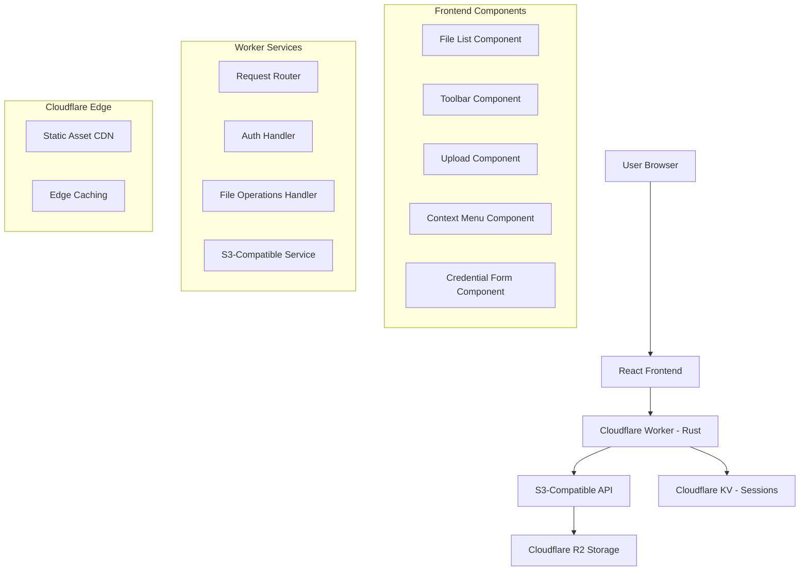

# Design Document

## Overview

The R2 File Explorer is a web application that provides a familiar desktop file manager interface for Cloudflare R2 buckets. The application will be built as a single-page application (SPA) using React for the frontend and a Cloudflare Workers backend written in Rust that interfaces with Cloudflare R2 through the S3-compatible API using user-provided API credentials. The design emphasizes security, performance, and user experience while leveraging Cloudflare's edge computing capabilities.

## Architecture

### High-Level Architecture



### Technology Stack

**Frontend:**
- React 18 with TypeScript
- React Router for navigation
- Fetch API for HTTP requests
- React Query for state management and caching
- Tailwind CSS for styling
- React Dropzone for file uploads

**Backend (Cloudflare Worker):**
- Rust with worker-rs framework
- Direct R2 bindings (no S3 SDK needed)
- Cloudflare KV for session storage
- JWT for authentication tokens
- Built-in CORS handling

**Infrastructure:**
- Cloudflare Workers for serverless compute
- Cloudflare R2 for object storage
- Cloudflare KV for session/auth data
- Cloudflare Pages for frontend hosting

## Components and Interfaces

### Frontend Components

#### 1. App Component
- Main application container
- Handles routing and global state
- Manages authentication state

#### 2. FileExplorer Component
- Primary interface component
- Contains toolbar, breadcrumb navigation, and file list
- Manages current directory state

#### 3. FileList Component
- Displays files and folders in current directory
- Supports grid and list view modes
- Handles selection and context menu triggers

#### 4. Toolbar Component
- Contains navigation buttons (back, forward, up)
- Upload button and new folder button
- View mode toggles and search functionality

#### 5. UploadZone Component
- Drag-and-drop file upload interface
- Progress tracking for multiple file uploads
- Error handling and retry mechanisms

#### 6. ContextMenu Component
- Right-click menu for file operations
- Dynamic menu items based on selection type
- Handles rename, delete, download operations

#### 7. AuthForm Component
- Credential input form (Account ID, Access Key ID, Secret Access Key, Bucket Name)
- Connection testing and validation
- Secure credential handling

### Backend API Endpoints (Cloudflare Worker)

#### Authentication Endpoints
```
POST /api/auth/login
- Body: { accountId, accessKeyId, secretAccessKey, bucketName }
- Response: { token, expiresIn }
- Validates credentials and stores session in KV with JWT token

POST /api/auth/verify
- Headers: Authorization: Bearer <token>
- Response: { valid: boolean, bucketName?: string }
- Validates JWT and checks KV session

POST /api/auth/logout
- Headers: Authorization: Bearer <token>
- Response: { success: boolean }
- Removes session from KV
```

#### File Operations Endpoints
```
GET /api/files?path=<path>&prefix=<prefix>
- Lists objects in specified path using R2 binding
- Response: { objects: [], folders: [], hasMore: boolean }

POST /api/files/upload
- Multipart file upload with streaming to R2
- Body: FormData with files and path
- Response: { uploaded: [], errors: [] }
- Uses R2 multipart upload for large files

GET /api/files/download?key=<objectKey>
- Downloads specific file via R2 binding
- Response: File stream with appropriate headers
- Supports range requests

DELETE /api/files?key=<objectKey>
- Deletes specific file or folder via R2 binding
- Response: { success: boolean, message: string }

PUT /api/files/rename
- Body: { oldKey, newKey }
- Response: { success: boolean, message: string }
- Implements as copy + delete operation

POST /api/files/folder
- Body: { path, name }
- Response: { success: boolean, message: string }
- Creates folder marker object in R2
```

### Rust Worker Service Layer

#### Worker Environment Bindings
```rust
use worker::*;

#[derive(Clone)]
pub struct Env {
    pub r2_bucket: Bucket,
    pub kv_sessions: kv::KvStore,
    pub jwt_secret: String,
}
```

#### R2 Service Implementation
```rust
pub struct R2Service {
    bucket: Bucket,
}

impl R2Service {
    pub fn new(bucket: Bucket) -> Self {
        Self { bucket }
    }
    
    pub async fn list_objects(&self, prefix: Option<&str>, delimiter: Option<&str>) -> Result<ListObjectsResult>;
    pub async fn put_object(&self, key: &str, data: Vec<u8>, content_type: Option<&str>) -> Result<()>;
    pub async fn get_object(&self, key: &str) -> Result<Option<Object>>;
    pub async fn delete_object(&self, key: &str) -> Result<()>;
    pub async fn create_multipart_upload(&self, key: &str) -> Result<MultipartUpload>;
    pub async fn upload_part(&self, upload: &MultipartUpload, part_number: u16, data: Vec<u8>) -> Result<UploadedPart>;
    pub async fn complete_multipart_upload(&self, upload: MultipartUpload, parts: Vec<UploadedPart>) -> Result<Object>;
}
```

#### Authentication Service
```rust
pub struct AuthService {
    kv: kv::KvStore,
    jwt_secret: String,
}

impl AuthService {
    pub fn new(kv: kv::KvStore, jwt_secret: String) -> Self {
        Self { kv, jwt_secret }
    }
    
    pub async fn validate_credentials(&self, account_id: &str, access_key_id: &str, secret_access_key: &str, bucket_name: &str) -> Result<bool>;
    pub async fn create_session(&self, credentials: R2Credentials) -> Result<String>;
    pub async fn validate_token(&self, token: &str) -> Result<Option<SessionData>>;
    pub async fn revoke_session(&self, token: &str) -> Result<()>;
    pub fn generate_jwt(&self, session_id: &str) -> Result<String>;
    pub fn verify_jwt(&self, token: &str) -> Result<String>;
}
```

#### S3-Compatible API Service
```rust
pub struct S3Service {
    account_id: String,
    access_key_id: String,
    secret_access_key: String,
}

impl S3Service {
    pub fn new(account_id: String, access_key_id: String, secret_access_key: String) -> Self {
        Self { account_id, access_key_id, secret_access_key }
    }
    
    pub async fn list_objects(&self, bucket_name: &str, prefix: Option<&str>, delimiter: Option<&str>) -> Result<Vec<FileObject>>;
    pub async fn put_object(&self, bucket_name: &str, key: &str, data: Vec<u8>, content_type: Option<&str>) -> Result<()>;
    pub async fn get_object(&self, bucket_name: &str, key: &str) -> Result<Vec<u8>>;
    pub async fn delete_object(&self, bucket_name: &str, key: &str) -> Result<()>;
    pub async fn copy_object(&self, bucket_name: &str, source_key: &str, dest_key: &str) -> Result<()>;
    pub async fn create_multipart_upload(&self, bucket_name: &str, key: &str) -> Result<String>;
    pub async fn upload_part(&self, bucket_name: &str, key: &str, upload_id: &str, part_number: u32, data: Vec<u8>) -> Result<String>;
    pub async fn complete_multipart_upload(&self, bucket_name: &str, key: &str, upload_id: &str, parts: Vec<(u32, String)>) -> Result<()>;
}
```

## Data Models

### File System Models

```typescript
interface FileObject {
  key: string;
  name: string;
  size: number;
  lastModified: Date;
  etag: string;
  type: 'file' | 'folder';
  mimeType?: string;
}

interface FolderObject {
  prefix: string;
  name: string;
  type: 'folder';
}

interface DirectoryListing {
  objects: FileObject[];
  folders: FolderObject[];
  currentPath: string;
  hasMore: boolean;
  continuationToken?: string;
}
```

### Upload Models

```typescript
interface UploadTask {
  id: string;
  file: File;
  path: string;
  progress: number;
  status: 'pending' | 'uploading' | 'completed' | 'error';
  error?: string;
  uploadId?: string; // For multipart uploads
  parts?: UploadedPart[];
}

interface UploadedPart {
  partNumber: number;
  etag: string;
}
```

### Authentication Models

```typescript
interface R2Credentials {
  accountId: string;
  accessKeyId: string;
  secretAccessKey: string;
  bucketName: string;
}

interface AuthSession {
  token: string; // Our JWT token
  expiresAt: Date;
  bucketName: string;
}
```

```rust
// Rust data models for Worker
#[derive(Serialize, Deserialize, Clone)]
pub struct R2Credentials {
    pub account_id: String,
    pub access_key_id: String,
    pub secret_access_key: String,
    pub bucket_name: String,
}

#[derive(Serialize, Deserialize)]
pub struct SessionData {
    pub session_id: String,
    pub bucket_name: String,
    pub created_at: u64,
    pub expires_at: u64,
}

#[derive(Serialize, Deserialize)]
pub struct FileObject {
    pub key: String,
    pub name: String,
    pub size: u64,
    pub last_modified: String,
    pub etag: String,
    pub object_type: String, // "file" or "folder"
    pub mime_type: Option<String>,
}
```

## Error Handling

### Error Categories

1. **Authentication Errors**
   - Invalid credentials
   - Expired tokens
   - Insufficient permissions

2. **Network Errors**
   - Connection timeouts
   - Rate limiting
   - Service unavailable

3. **File Operation Errors**
   - File not found
   - Access denied
   - Storage quota exceeded

4. **Validation Errors**
   - Invalid file names
   - File size limits
   - Unsupported file types

### Error Handling Strategy

```typescript
interface ApiError {
  code: string;
  message: string;
  details?: any;
  retryable: boolean;
}

class ErrorHandler {
  static handleR2Error(error: any): ApiError;
  static isRetryableError(error: ApiError): boolean;
  static getUserFriendlyMessage(error: ApiError): string;
}
```

### Retry Logic
- Exponential backoff for retryable errors
- Maximum retry attempts: 3
- Retry delays: 1s, 2s, 4s
- User notification for persistent failures

## Testing Strategy

### Unit Testing
- **Frontend**: Jest + React Testing Library
  - Component rendering and interaction
  - State management logic
  - Utility functions
  
- **Backend (Rust Worker)**: Rust testing framework
  - Unit tests for service layer methods
  - Mock R2 and KV bindings for testing
  - Error handling scenarios
  - JWT token generation and validation

### Integration Testing
- Cloudflare Workers local development environment
- End-to-end file operations with real R2 bindings
- Authentication flow testing with KV storage
- Upload/download workflows with multipart support

### Performance Testing
- Large file upload handling with streaming
- Directory listing with pagination
- Concurrent request handling at edge
- Memory usage optimization in Worker runtime

### Security Testing
- Credential handling validation
- JWT token security and expiration
- Input sanitization and path traversal prevention
- CORS configuration testing

## Security Considerations

### Credential Management
- Credentials never stored in frontend or Worker memory
- JWT tokens with short expiration (1 hour)
- Session data stored securely in Cloudflare KV
- Automatic token refresh mechanism
- R2 credentials validated on first use and not persisted

### Input Validation
- File name sanitization in Rust Worker
- Path traversal prevention with strict path validation
- File size limits enforced at Worker level
- Request rate limiting via Cloudflare's built-in protection

### API Security
- CORS configuration handled by Worker
- Request size limits enforced by Workers runtime
- Authentication middleware for all protected routes
- Audit logging via Workers Analytics and Logpush

## Performance Optimizations

### Frontend Optimizations
- Virtual scrolling for large directory listings
- Lazy loading of file thumbnails
- Debounced search functionality
- Optimistic UI updates

### Backend Optimizations
- Connection pooling for R2 API calls
- Response caching for directory listings
- Streaming for large file downloads
- Multipart uploads for files > 100MB

### Caching Strategy
- Browser caching for static assets
- API response caching (5 minutes for directory listings)
- ETags for conditional requests
- Service worker for offline functionality

## Deployment Architecture

### Development Environment
- Wrangler CLI for local Worker development
- `wrangler dev` for local testing with real R2/KV bindings
- React development server for frontend hot reload
- Environment-specific configuration via wrangler.toml

### Production Environment
- **Frontend**: Deployed to Cloudflare Pages
  - Automatic builds from Git repository
  - Global CDN distribution
  - Custom domain support with SSL
  
- **Backend**: Deployed as Cloudflare Worker
  - Global edge deployment (200+ locations)
  - Automatic scaling and load balancing
  - Built-in DDoS protection and rate limiting
  
- **Storage**: Cloudflare R2 and KV
  - R2 bucket for file storage
  - KV namespace for session management
  - Global replication and consistency

### Configuration Management
```toml
# wrangler.toml
name = "r2-file-explorer-api"
main = "src/lib.rs"
compatibility_date = "2024-01-01"

[[r2_buckets]]
binding = "R2_BUCKET"
bucket_name = "file-explorer-storage"

[[kv_namespaces]]
binding = "KV_SESSIONS"
id = "session-storage-namespace"

[vars]
JWT_SECRET = "your-jwt-secret"
CORS_ORIGINS = "https://your-frontend-domain.pages.dev"
```

## Observability and Monitoring

### Comprehensive Monitoring Strategy

The R2 File Explorer requires robust observability to ensure reliability, performance, and security. The monitoring strategy leverages Cloudflare's built-in analytics capabilities while providing custom metrics and logging for application-specific insights.

### Metrics Collection

#### Application Metrics
```rust
// Custom metrics tracked in Worker
pub struct Metrics {
    pub request_count: Counter,
    pub request_duration: Histogram,
    pub file_operations: Counter,
    pub upload_size: Histogram,
    pub error_count: Counter,
    pub auth_attempts: Counter,
}

impl Metrics {
    pub fn record_request(&self, method: &str, path: &str, status: u16, duration_ms: f64);
    pub fn record_file_operation(&self, operation: &str, success: bool, file_size: u64);
    pub fn record_auth_attempt(&self, success: bool, error_type: Option<&str>);
    pub fn record_error(&self, error_type: &str, endpoint: &str);
}
```

#### Key Performance Indicators (KPIs)
- **Request Metrics**: Request count, response time, error rate by endpoint
- **File Operations**: Upload/download success rate, file size distribution, operation latency
- **Authentication**: Login success rate, token validation failures, session duration
- **User Experience**: Page load times, time to first byte, interaction response times
- **Resource Usage**: Memory consumption, CPU utilization, bandwidth usage

### Logging Architecture

#### Structured Logging Format
```rust
use serde_json::json;

pub struct Logger {
    request_id: String,
    user_session: Option<String>,
}

impl Logger {
    pub fn info(&self, message: &str, context: serde_json::Value) {
        let log_entry = json!({
            "timestamp": chrono::Utc::now().to_rfc3339(),
            "level": "INFO",
            "request_id": self.request_id,
            "session_id": self.user_session,
            "message": message,
            "context": context
        });
        console_log!("{}", log_entry.to_string());
    }
    
    pub fn error(&self, message: &str, error: &str, context: serde_json::Value);
    pub fn warn(&self, message: &str, context: serde_json::Value);
    pub fn debug(&self, message: &str, context: serde_json::Value);
}
```

#### Log Categories
1. **Request Logs**: HTTP method, path, status code, response time, user agent
2. **Authentication Logs**: Login attempts, token validation, session creation/destruction
3. **File Operation Logs**: Upload/download events, file sizes, operation duration
4. **Error Logs**: Exception details, stack traces, error context, recovery actions
5. **Security Logs**: Failed authentication attempts, suspicious activity, rate limiting events
6. **Performance Logs**: Slow queries, memory usage spikes, timeout events

### Error Tracking and Alerting

#### Error Classification
```typescript
enum ErrorSeverity {
  LOW = 'low',
  MEDIUM = 'medium',
  HIGH = 'high',
  CRITICAL = 'critical'
}

interface ErrorEvent {
  id: string;
  timestamp: Date;
  severity: ErrorSeverity;
  category: string;
  message: string;
  stackTrace?: string;
  userContext?: {
    sessionId: string;
    bucketName: string;
    userAgent: string;
  };
  requestContext?: {
    method: string;
    path: string;
    headers: Record<string, string>;
  };
}
```

#### Alert Conditions
- **Critical**: Authentication system failures, R2 service unavailable, Worker crashes
- **High**: Upload/download failure rate > 5%, API response time > 5s
- **Medium**: Error rate > 1%, Memory usage > 80%, Unusual traffic patterns
- **Low**: Deprecated API usage, Configuration warnings, Performance degradation

### Real User Monitoring (RUM)

#### Frontend Performance Tracking
```typescript
class PerformanceMonitor {
  private static instance: PerformanceMonitor;
  
  public trackPageLoad(pageName: string) {
    const navigation = performance.getEntriesByType('navigation')[0] as PerformanceNavigationTiming;
    this.sendMetric('page_load', {
      page: pageName,
      loadTime: navigation.loadEventEnd - navigation.fetchStart,
      domContentLoaded: navigation.domContentLoadedEventEnd - navigation.fetchStart,
      firstContentfulPaint: this.getFirstContentfulPaint(),
    });
  }
  
  public trackUserInteraction(action: string, duration: number, success: boolean) {
    this.sendMetric('user_interaction', {
      action,
      duration,
      success,
      timestamp: Date.now(),
    });
  }
  
  public trackFileOperation(operation: string, fileSize: number, duration: number, success: boolean) {
    this.sendMetric('file_operation', {
      operation,
      fileSize,
      duration,
      success,
      timestamp: Date.now(),
    });
  }
  
  private sendMetric(type: string, data: any) {
    // Send to analytics endpoint
    fetch('/api/analytics/rum', {
      method: 'POST',
      headers: { 'Content-Type': 'application/json' },
      body: JSON.stringify({ type, data, userAgent: navigator.userAgent }),
    }).catch(console.error);
  }
}
```

#### User Experience Metrics
- **Core Web Vitals**: Largest Contentful Paint (LCP), First Input Delay (FID), Cumulative Layout Shift (CLS)
- **Custom Metrics**: Time to first file list, Upload completion time, Download start time
- **Error Tracking**: JavaScript errors, failed API calls, network timeouts
- **User Journey**: Authentication flow completion, File operation success rates

### Health Checks and Uptime Monitoring

#### Health Check Endpoints
```rust
// Worker health check endpoint
pub async fn health_check(env: &Env) -> Result<Response> {
    let mut checks = Vec::new();
    
    // Check R2 connectivity
    let r2_status = check_r2_health(&env.r2_bucket).await;
    checks.push(("r2", r2_status));
    
    // Check KV connectivity
    let kv_status = check_kv_health(&env.kv_sessions).await;
    checks.push(("kv", kv_status));
    
    // Check JWT functionality
    let jwt_status = check_jwt_health(&env.jwt_secret);
    checks.push(("jwt", jwt_status));
    
    let all_healthy = checks.iter().all(|(_, status)| *status);
    let status_code = if all_healthy { 200 } else { 503 };
    
    Response::from_json(&json!({
        "status": if all_healthy { "healthy" } else { "unhealthy" },
        "timestamp": chrono::Utc::now().to_rfc3339(),
        "checks": checks.into_iter().collect::<std::collections::HashMap<_, _>>(),
        "version": env!("CARGO_PKG_VERSION")
    }))?.with_status(status_code)
}
```

#### Synthetic Monitoring
- **Endpoint Monitoring**: Regular health checks for all API endpoints
- **User Flow Monitoring**: Automated tests for critical user journeys
- **Performance Baselines**: Regular performance benchmarking
- **Geographic Monitoring**: Health checks from multiple global locations

### Analytics and Business Intelligence

#### Usage Analytics
```typescript
interface UsageMetrics {
  dailyActiveUsers: number;
  totalFileOperations: number;
  storageUsage: number;
  popularFileTypes: Record<string, number>;
  averageSessionDuration: number;
  errorRateByOperation: Record<string, number>;
}

class AnalyticsCollector {
  public trackUserSession(sessionId: string, bucketName: string) {
    // Track session start, duration, operations performed
  }
  
  public trackFileOperation(operation: string, fileType: string, fileSize: number, success: boolean) {
    // Track file operations for usage patterns
  }
  
  public generateDashboard(): UsageMetrics {
    // Aggregate metrics for business intelligence
  }
}
```

#### Business Metrics
- **User Engagement**: Session duration, operations per session, return user rate
- **Feature Usage**: Most used operations, file type distribution, upload/download patterns
- **Performance Trends**: Response time trends, error rate trends, capacity utilization
- **Cost Optimization**: Bandwidth usage, storage costs, compute costs per operation

### Monitoring Infrastructure

#### Cloudflare Analytics Integration
```toml
# wrangler.toml analytics configuration
[analytics_engine_datasets]
binding = "ANALYTICS"
dataset = "r2-file-explorer-metrics"
```

```rust
// Custom analytics events
pub async fn send_analytics_event(analytics: &AnalyticsEngine, event_type: &str, data: serde_json::Value) {
    let event = json!({
        "timestamp": chrono::Utc::now().timestamp(),
        "event_type": event_type,
        "data": data
    });
    
    analytics.write_data_point(event).await.unwrap_or_else(|e| {
        console_log!("Failed to send analytics event: {}", e);
    });
}
```

#### External Monitoring Integration
- **Grafana Dashboards**: Custom dashboards for operational metrics
- **Prometheus Metrics**: Export metrics in Prometheus format
- **Datadog Integration**: APM and infrastructure monitoring
- **PagerDuty Alerts**: Incident management and escalation

### Privacy and Compliance

#### Data Privacy
- **PII Protection**: No personally identifiable information in logs
- **Data Retention**: Automatic log rotation and cleanup
- **Anonymization**: User session IDs instead of credentials
- **GDPR Compliance**: Right to deletion, data portability

#### Security Monitoring
- **Threat Detection**: Unusual access patterns, brute force attempts
- **Audit Logging**: All administrative actions, configuration changes
- **Compliance Reporting**: Regular security and compliance reports
- **Incident Response**: Automated incident detection and response workflows

### Monitoring Dashboard Design

#### Operational Dashboard
- **System Health**: Service status, error rates, response times
- **Resource Usage**: Memory, CPU, bandwidth utilization
- **User Activity**: Active sessions, operations per minute
- **Alert Status**: Current alerts, recent incidents

#### Business Dashboard
- **Usage Trends**: Daily/weekly/monthly usage patterns
- **Feature Adoption**: New feature usage, user engagement
- **Performance Metrics**: User satisfaction scores, completion rates
- **Cost Analysis**: Resource costs, optimization opportunities